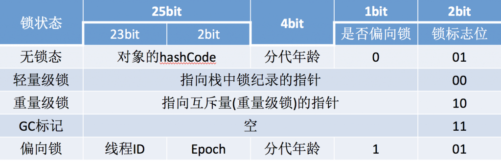
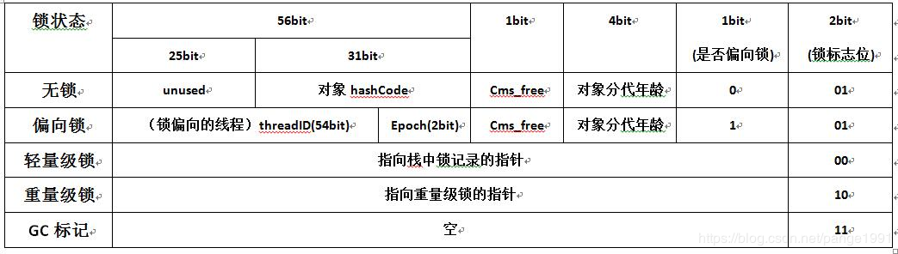

## 对象的内存布局

    限于普通Java对象，不包括数组和Class对象等
    
HotSpot 虚拟机中，对象在内存中存储的布局分为3块区域：

- 1、对象头（Header）

      虚拟机的对象头包括两部分信息，
      
      - Mark Word
      第一部分用于存储对象自身的运行时数据，如hashCode、GC分代年龄、锁状态标志、线程持有的锁、偏向线程ID、偏向时间戳等。
      Java对象头一般占有两个机器码（在32位虚拟机中，1个机器码等于4字节，也就是32bit），
      但是如果对象是数组类型，则需要三个机器码，因为JVM虚拟机可以通过Java对象的元数据信息确定Java对象的大小，
      但是无法从数组的元数据来确认数组的大小，所以用一块来记录数组长度。
      
      - kclass
      对象的另一部分是类型指针（kclass），即对象指向它的类元数据的指针，虚拟机通过这个指针来确定这个对象是那个类的实例。
      另外如果对象是一个Java数组，那再对象头中还必须有一块用于记录数组长度的数据，
      因为虚拟机可以通过普通Java对象的元数据信息确定Java对象的大小，但是从数组的元数据中却无法确定数组的大小。
      
      考虑到虚拟机的空间效率，Mark Word被设计成一个非固定的数据结构以便在极小的空间内存存储尽量多的数据，
      它会根据对象的状态复用自己的存储空间，也就是说，Mark Word会随着程序的运行发生变化，变化状态如下（32位虚拟机）：   
     
     在32位的虚拟机中：
     
     
     在64位的虚拟机中：
     
- 2、实例数据（Instance Data）

- 3、对齐填充（Padding）

## 对象访问
目前主流的访问方式有使用句柄和直接指针两种：

- 1、使用句柄

      如果使用句柄访问的话，那么Java 堆中将划分出一块内存来作为句柄池，reference 中存储的就是对象的句柄地址，
      而句柄中包含来对象实例数据与类型数据各自的具体地址信息。
- 2、直接指针

      如果使用直接指针访问，那么Java 堆对象的布局中就必须考虑如何放置访问类型数据的相关信息，而reference 中
      存储的直接就是对象地址。
      
  HotSpot 是使用第二种方式进行对象访问的。    